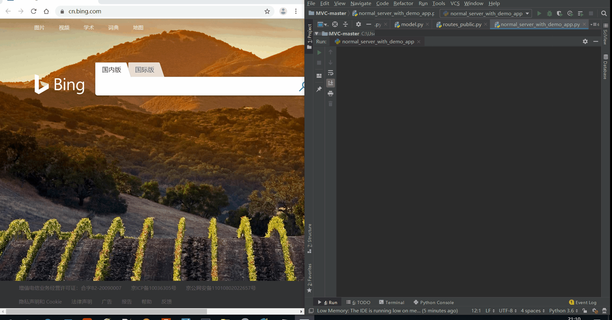
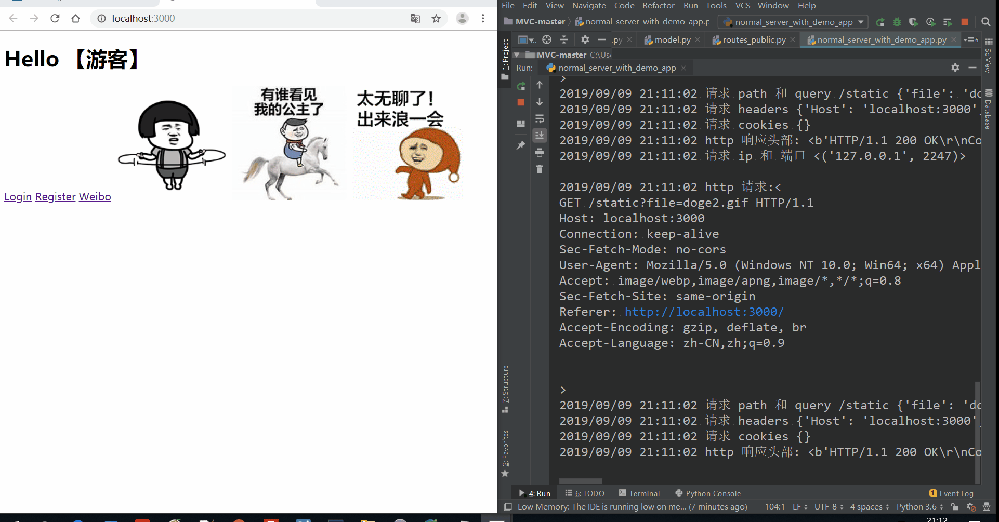
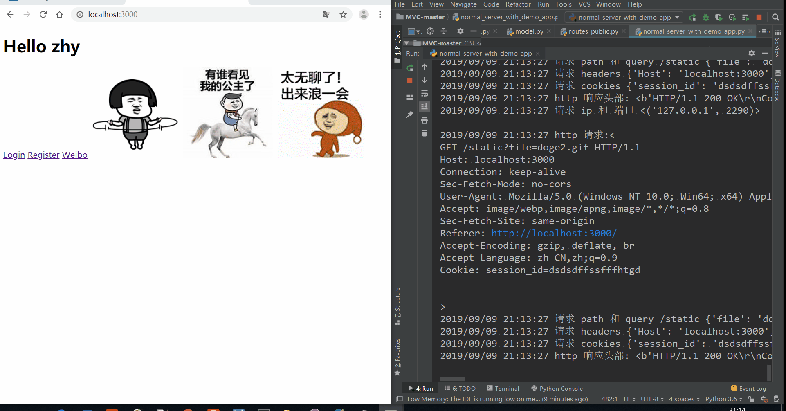

# MVC Web框架和HTTP服务器

# 技术栈

-Python + HTTP + Socket + MySQL + jinjia2

# HTTP服务器和 MVC Web简介

- 利用Socket实现HTTP服务器，能对响应进行接收、解析、返回
- 使用 Python 多线程实现服务的并发
- 实现了微博的增删改查功能和用户评论功能。
- 实现用户登录、验证模块、Cookie和Session、密码采用加盐摘要后存储。

# MVC Web 框架

 - Model 框架层：使用 MySQL ，自制ORM（对象关系映射）实现增删改查的原生SQL语句封装。
 - View 视图层：使用 Jinja2 渲染模板实现数据的有序显示，提高开发效率。
 - Controller 控制器：使用 Python 高阶函数，实现路由注册、页面路由的分发、权限验证等高级功能。 包含数据实例化、重定向、特定格式数据（HTML、JSON）返回等辅助功能。

**功能演示**

- 请求解析和响应
 

- 注册和带有session的登录功能

- 微博和评论的添加修改

